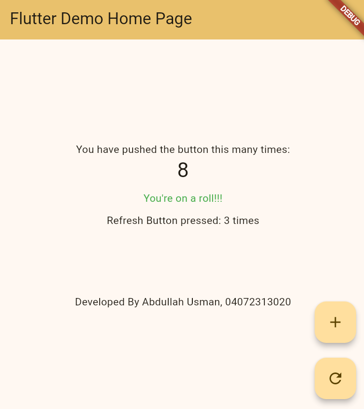

# Flutter Counter Enhancement & State Management

## Overview
This project enhances the default Flutter starter counter application by implementing custom state management, custom theming, and additional UI components according to assignment specifications.

---

## Completed Tasks

### 1. Add a Reset Button
- Added a secondary `FloatingActionButton` configured with `Icons.refresh`.
- Arranged both floating action buttons side-by-side using a `Row` layout (with appropriate spacing) so neither overlaps with the other.
- Tapping the reset button resets the main counter value back to `0`.

### 2. Personalised Threshold Message
- Displayed a conditional message: `"You're on a roll!"` in green text below the counter value.
- Logic is dynamically tied to `myThreshold` (rather than a hardcoded value), appearing only when the counter strictly exceeds the configured threshold.

### 3. Reset Counter Tracker
- Introduced an independent state variable (e.g., `_resetCount`) to track how many times the reset action has been triggered.
- Rendered the label on screen as: `Resets used: N`.
- Managed updates through a dedicated `setState()` call inside the reset handler to maintain distinct state separation.

### 4. Personalised Theme
- Updated the app's `ThemeData` configuration.
- Configured `colorSchemeSeed: mySeedColor` using the personal parameters rather than the default lecture palette.

### 5. About Line
- Added a subtle footer `Text` widget positioned near the bottom of the screen:
  `Built by [Your Name] · [Your Student ID / Date]`

---

## App Screenshot

Below is a preview of the running application demonstrating the customized theme, dual floating action buttons, reset tracker, and threshold alert:

---

## Written Reflection: Why is `setState()` used?

setState(() {...}) tells Flutter that some data used by the screen has changed, so it should run build() again and display the updated values. Without setState(), the variable may change in the program, but Flutter does not know that it needs to rebuild the UI, so the old value remains visible on the screen.